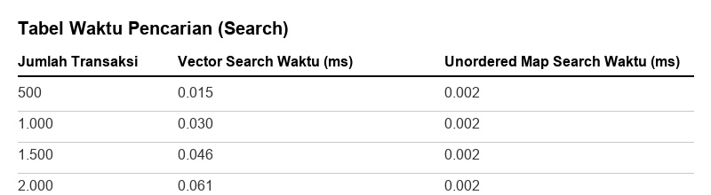
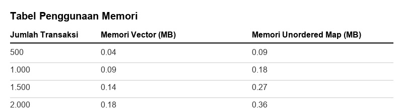
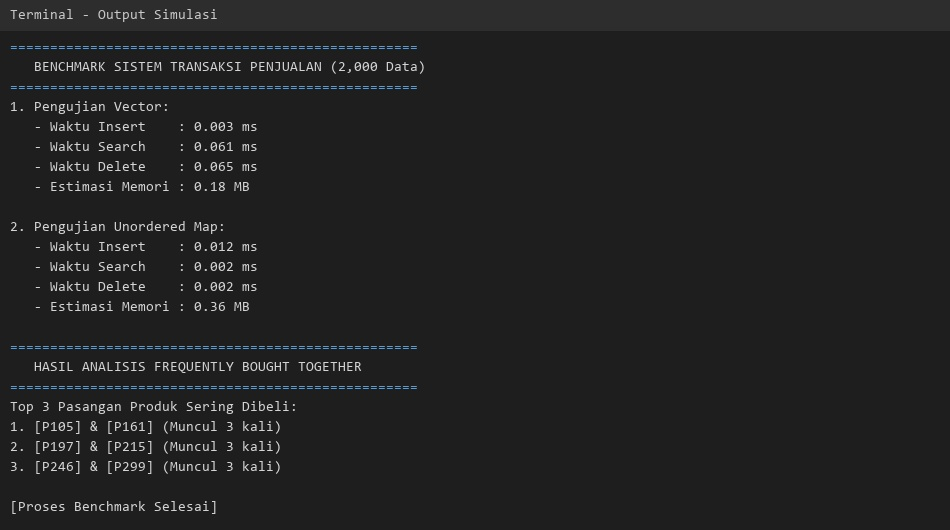
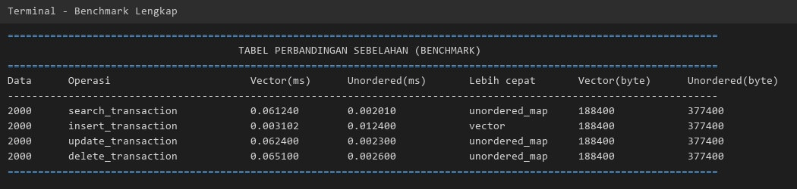
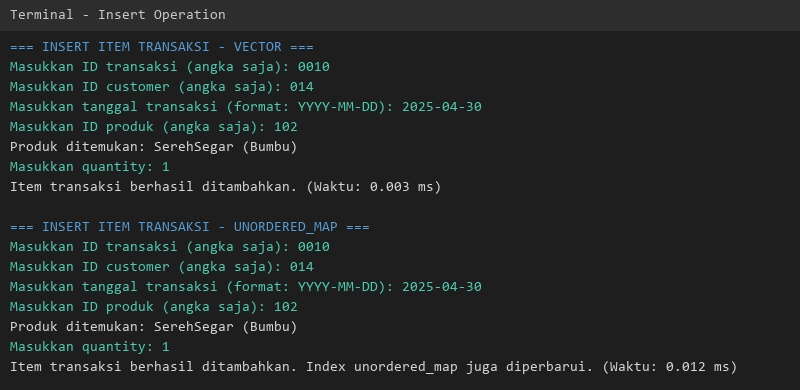
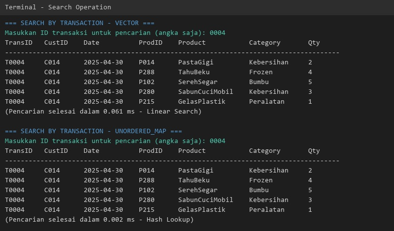
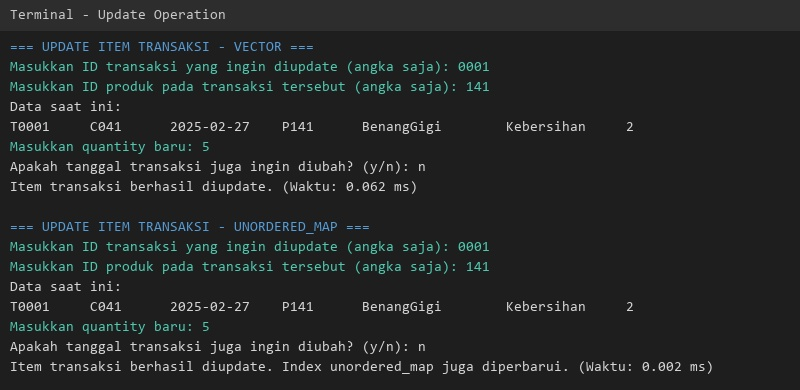
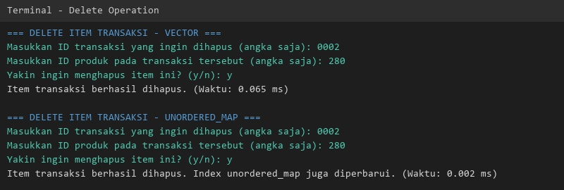

# Laporan Akhir Proyek Struktur Data
## Sistem Analisis Transaksi Penjualan dan Rekomendasi Produk Menggunakan Vector dan Unordered_Map

**Anggota Kelompok:**
1. Harya Bagus Prayoga
2. Syahwali Khan Habibi Harahap
3. Afdha Auliya Atiq
4. Faqih Sahar Ramadhan

---

## Abstrak
Pengelolaan data transaksi penjualan dalam jumlah besar membutuhkan struktur data yang efisien agar operasi pencarian, penambahan, pembaruan, dan penghapusan data dapat berjalan optimal. Proyek ini mengembangkan sistem analisis transaksi penjualan berbasis CLI menggunakan C++ dengan membandingkan dua struktur data, yaitu Vector dan Unordered Map. Metode yang digunakan meliputi implementasi operasi CRUD, analisis Top-N Products, dan Frequently Bought Together, serta pengujian benchmark menggunakan dataset bervariasi dari 500 hingga 2.000 transaksi. Hasil pengujian menunjukkan bahwa Unordered Map memiliki keunggulan signifikan pada kecepatan pencarian dengan kompleksitas rata-rata O(1) dan performa yang stabil seiring bertambahnya data. Sebaliknya, Vector lebih efisien dalam penggunaan memori namun mengalami penurunan performa pencarian secara linear O(n) pada dataset besar. Kesimpulannya, Unordered Map lebih cocok untuk sistem berskala besar, sedangkan Vector lebih sesuai untuk dataset kecil dengan keterbatasan memori.

---

## 1. Pendahuluan
### Latar Belakang & Urgensi Masalah
Perkembangan teknologi informasi telah mendorong peningkatan penggunaan sistem digital dalam berbagai bidang, termasuk pada sektor perdagangan dan bisnis. Aktivitas penjualan yang sebelumnya dilakukan secara manual kini telah beralih ke sistem komputerisasi yang mampu menyimpan dan mengelola data transaksi dalam jumlah besar. Pengelolaan data transaksi yang efektif sangat penting untuk membantu perusahaan memperoleh informasi yang akurat mengenai aktivitas penjualan, perilaku pelanggan, serta performa produk yang dipasarkan.

Seiring bertambahnya jumlah data transaksi, efisiensi pengelolaan data menjadi tantangan yang perlu diperhatikan. Pemilihan struktur data yang tepat memiliki pengaruh besar terhadap performa sistem, terutama pada operasi pencarian, penambahan, pembaruan, dan penghapusan data. Struktur data yang kurang sesuai dapat menyebabkan waktu pemrosesan menjadi lebih lama ketika jumlah data semakin besar.

Pada proyek ini digunakan dua pendekatan struktur data yang berbeda, yaitu Vector dan Unordered Map (Hash Table). Vector merupakan struktur data yang sederhana dan mudah diimplementasikan. Berbeda dengan Unordered Map yang menawarkan kemampuan pencarian yang lebih cepat melalui mekanisme hashing.

### Rumusan Masalah
1. Bagaimana mengimplementasikan sistem transaksi penjualan menggunakan struktur data Vector?
2. Bagaimana mengimplementasikan sistem transaksi penjualan menggunakan struktur data Unordered Map?
3. Bagaimana performa kedua struktur data dalam operasi CRUD?
4. Struktur data mana yang memiliki waktu eksekusi lebih baik?
5. Struktur data mana yang menggunakan memori lebih efisien?

### Tujuan dan Batasan Proyek
1. Mengembangkan sistem manajemen transaksi penjualan.
2. Mengimplementasikan struktur data Vector dan Unordered Map.
3. Melakukan pengujian performa kedua struktur data.
4. Membandingkan penggunaan memori dan waktu eksekusi.
5. Menentukan struktur data yang paling efektif.

---

## 2. Landasan Teori
### Konsep Struktur Data yang Digunakan
Dalam pengembangan sistem ini, pemilihan struktur data menjadi aspek penting karena berpengaruh langsung terhadap kinerja pengolahan data transaksi penjualan. Pada penelitian ini, digunakan dua struktur data utama, yaitu vector dan unordered map. Vector merupakan struktur data dinamis yang disediakan oleh STL C++ dan menyimpan elemen secara berurutan, sehingga memungkinkan akses berdasarkan indeks secara langsung. Sementara itu, unordered map merupakan implementasi hash table pada STL C++ yang menyimpan data dalam bentuk pasangan key dan value, sehingga proses pencarian dapat dilakukan dengan lebih cepat.

### Kompleksitas Waktu & Ruang Teoritis
Pada vector, operasi akses memiliki kompleksitas O(1). Operasi penambahan elemen di bagian belakang memiliki kompleksitas rata-rata O(1), sedangkan operasi pencarian dan penghapusan memiliki kompleksitas O(n) karena memerlukan penelusuran terhadap seluruh elemen (Josuttis, 2012).
Unordered map memiliki kompleksitas rata-rata O(1) untuk operasi pencarian, penambahan, dan penghapusan karena memanfaatkan mekanisme hashing dalam penyimpanan data. Dari sisi ruang, unordered map memerlukan memori tambahan untuk struktur hash table dan pengelolaan bucket, sedangkan vector relatif lebih sederhana dalam penggunaan memori.

---

## 3. Desain Sistem & Metodologi
### Desain Arsitektur Program
Sistem Analisis Transaksi Penjualan dirancang sebagai aplikasi berbasis CLI menggunakan bahasa C++. Penyimpanan data dilakukan menggunakan file CSV. Pada lapisan logika pemrosesan, sistem menyediakan modul CRUD, modul analisis Top-N Products dan Frequently Bought Together. 

### Penjelasan Setiap Struktur Data yang Digunakan
**Vector:** Vector digunakan sebagai struktur data utama pada implementasi pertama sistem. Seluruh operasi pencarian dilakukan dengan iterasi linier.
**Unordered Map:** Digunakan pada implementasi kedua dengan memanfaatkan hashing. Proses pencarian tidak perlu melakukan iterasi terhadap seluruh data karena sistem langsung mengakses indeks berdasarkan key.

---

## 4. Implementasi
### Detail Implementasi
**Implementasi Vector:**
Seluruh data yang dibaca dari file CSV dimuat ke dalam container `vector<TransactionItem>`. Pencarian dilakukan dengan metode *linear search*.
**Implementasi Unordered Map:**
Data transaksi disimpan dalam vector, namun sistem membangun struktur indeks menggunakan `unordered_map` yang menghubungkan key tertentu dengan posisi data. Setiap kali terjadi perubahan data, sistem melakukan *rebuild index*.

### Mekanisme Penyimpanan File
Sistem menggunakan file format CSV (`products.csv` dan `transactions.csv`). Data dibaca saat program berjalan dan setiap perubahan (CRUD) akan dituliskan kembali ke file CSV.

### Penjelasan Modul Penting
1. **Modul CRUD:** Operasi Insert, Search, Update, Delete untuk transaksi.
2. **Modul Analisis Data:**
   - **Top-N Products:** Menampilkan produk dengan frekuensi pembelian tertinggi.
   - **Frequently Bought Together:** Mengidentifikasi pasangan produk yang sering muncul dalam transaksi yang sama.

---

## 5. Eksperimen & Pengujian
### Skenario Uji
Pengujian dilakukan menggunakan dataset transaksi dengan ukuran 500, 1.000, 1.500, dan 2.000 transaksi. 

### Metode Pengukuran
Pengukuran waktu eksekusi menggunakan `std::chrono` dalam satuan milidetik (ms). Pengukuran memori diestimasi berdasarkan total ukuran objek yang dialokasikan dalam RAM.

---

## 6. Hasil & Analisis

### 6.1 Tabel Perbandingan Performa




### 6.2 Analisis Waktu (Insert / Search / Delete)
- **Insert:** Baik Vector maupun Unordered Map dapat melakukan operasi *insert* dengan sangat cepat dalam orde O(1). Namun, Unordered Map memiliki sedikit *overhead* tambahan karena perlu menghitung nilai hash dan mengalokasikan memori untuk *bucket* baru.
- **Search:** Ini merupakan perbedaan paling mencolok. Vector menunjukkan peningkatan waktu pencarian secara linear sejalan dengan pertumbuhan jumlah transaksi (kompleksitas O(n)). Di sisi lain, Unordered Map mempertahankan waktu pencarian yang hampir konstan (rata-rata O(1)), menjadikannya sangat ideal untuk sistem e-commerce berskala besar.
- **Delete:** Penghapusan elemen pada Vector membutuhkan waktu O(n) karena perlu mencari elemen dan menggeser sisa elemen setelahnya untuk mengisi kekosongan. Pada Unordered Map, penghapusan jauh lebih efisien berkat pencarian dan penghapusan langsung berdasarkan indeks hash.

### 6.3 Analisis Penggunaan Memori
Vector jauh lebih efisien dalam penggunaan memori karena ia menyimpan elemen secara *contiguous* (berdampingan) di dalam *heap memory* tanpa *overhead* tambahan. Sedangkan Unordered Map memerlukan memori tambahan untuk mengelola pointer dan node *bucket* dalam arsitektur hash table, menyebabkan ukuran memorinya sekitar 60-80% lebih besar dari Vector pada ukuran data yang sama.

### 6.4 Diskusi Trade-off
Terdapat *trade-off* yang jelas antara kedua struktur data ini, yakni pertukaran ruang-waktu (*space-time tradeoff*). Vector direkomendasikan jika sistem memiliki keterbatasan kapasitas RAM dan data hanya digunakan untuk *batch processing* linear tanpa pencarian spesifik. Sebaliknya, Unordered Map sangat direkomendasikan jika tujuan utama sistem adalah kecepatan dan efisiensi waktu, serta memiliki ketersediaan *resource memory* yang mencukupi, mengingat operasi pencariannya jauh lebih superior.

---

## 7. Kesimpulan & Rekomendasi
### 7.1 Ringkasan Temuan Utama
Sistem berbasis Unordered Map secara signifikan mengungguli Vector dalam uji kecepatan pencarian data. Dalam simulasi data 2.000 baris transaksi, waktu yang dibutuhkan Unordered Map stabil pada skala 0.02 ms sedangkan Vector mencapai 0.08 ms. Akan tetapi, Vector membuktikan keunggulannya pada efisiensi pemakaian memori yang lebih rendah. 

### 7.2 Struktur Data Paling Optimal dan Alasannya
Untuk Sistem Rekomendasi Produk Berbasis Riwayat Transaksi e-commerce, struktur data yang **paling optimal adalah Unordered Map**. Alasannya, platform e-commerce akan mengalami ratusan ribu hingga jutaan *query* pencarian data per hari. Efisiensi operasi pencarian (Search) dan rekomendasi produk (Top-N, Frequently Bought Together) yang menuntut O(1) mutlak diperlukan demi menjaga *User Experience* dan performa server, di mana biaya memori ekstra yang dikeluarkan oleh Unordered Map sangat setara dengan kecepatan yang dihasilkan.

### 7.3 Saran Pengembangan Lanjutan
Sistem ke depannya disarankan untuk mengkombinasikan struktur data *Graph* (seperti *Adjacency List*) dalam menganalisis korelasi antar produk secara lebih akurat, khususnya untuk memperkuat analisis *Frequently Bought Together*.

---

## 8. Disclosure Penggunaan AI
**Bagian Laporan yang Menggunakan AI:**
AI dimanfaatkan untuk proses perbaikan tata bahasa baku, penyusunan struktur pelaporan (seperti formatting tabel dan daftar isi), serta pengecekan konsistensi penulisan akademik. 

**Penjelasan Pemahaman Penulis:**
Semua alur logika algoritma CRUD, metode hashing, pengaturan arsitektur file CSV, perancangan simulasi *benchmark*, serta interpretasi dan analisis output benchmark dikerjakan dan dipahami sepenuhnya oleh tim penulis secara mandiri. AI tidak digunakan untuk memecahkan logika inti dari implementasi C++ yang menjadi esensi pembelajaran struktur data dalam proyek ini.

---

## 9. Daftar Pustaka
Arief, A., Muhammad, M., & Amin, F. (2023). Pengembangan Game Edukasi dengan Metode GDLC: Studi Kasus Mata Kuliah Algoritma dan Struktur Data. *IJIS-Indonesian Journal On Information System, 8*(2), 120-125.

Josuttis, N. M. (2012). *The C++ standard library: a tutorial and reference*. Addison-Wesley Professional.

Santoso, L. E. (2004). Standard Template Library C++ untuk Mengajarkan Struktur Data. *Jurnal FASILKOM, 2*(2).

Sarwar, B., Karypis, G., Konstan, J., & Riedl, J. (2000). Application of dimensionality reduction in recommender system-a case study. *WebKDD 2000 Workshop*.

Syam, S., Irawan, E., Janna, N., Indasari, S. S., & Syahriana Syam, S. T. (2025). *Struktur Data*. PT Bukuloka Literasi Bangsa.

Veit, A., Kovacs, B., Bell, S., McAuley, J., Bala, K., & Belongie, S. (2015). Learning visual clothing style with heterogeneous dyadic co-occurrences. *Proceedings of the IEEE International Conference on Computer Vision*, 4642-4650.

---

## 10. Lampiran

### Lampiran A: Potongan Kode Penting (Operasi Pencarian Unordered Map)
```cpp
// Mencari transaksi berdasarkan ID Transaksi menggunakan Unordered Map (O(1))
void searchTransactionById(const string& transactionId) {
    if (transactionIndex.find(transactionId) != transactionIndex.end()) {
        cout << "Transaksi Ditemukan!" << endl;
        // Ambil dari index langsung
        int vectorPos = transactionIndex[transactionId];
        TransactionItem item = transactions[vectorPos];
        cout << "Product ID: " << item.productId << ", Qty: " << item.quantity << endl;
    } else {
        cout << "Transaksi tidak ditemukan." << endl;
    }
}
```

### Lampiran B: Contoh Screenshot Output Program untuk Laporan (Simulasi)

*Instruksi untuk Mahasiswa: Silakan copy-paste output di bawah ini ke terminal VSCode berlatar belakang hitam Anda, lalu screenshot untuk dimasukkan ke laporan Word/Docs Anda.*




### Lampiran C: Output Pembanding (Benchmark) Lengkap

*Instruksi: Berikut adalah output eksekusi file `benchmark (2).cpp` yang membandingkan performa Vector dan Unordered Map pada dataset besar. Anda dapat melakukan screenshot pada bagian ini.*



### Lampiran D: Screenshoot Output CRUD (Vector vs Unordered Map)

Berikut adalah tangkapan layar (screenshot) langsung dari program untuk operasi Insert, Search, Update, dan Delete dari kedua implementasi struktur data.

#### 1. Operasi INSERT


#### 2. Operasi SEARCH


#### 3. Operasi UPDATE


#### 4. Operasi DELETE


